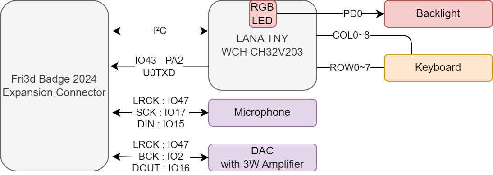
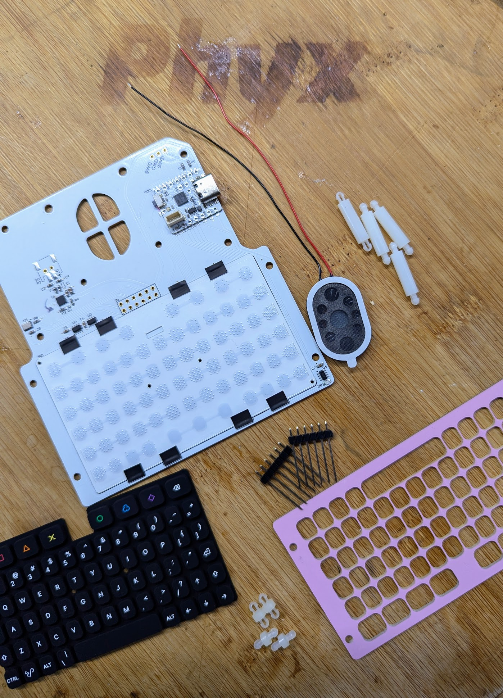
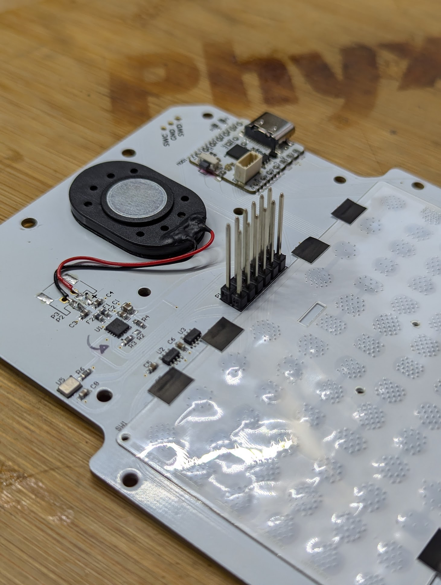
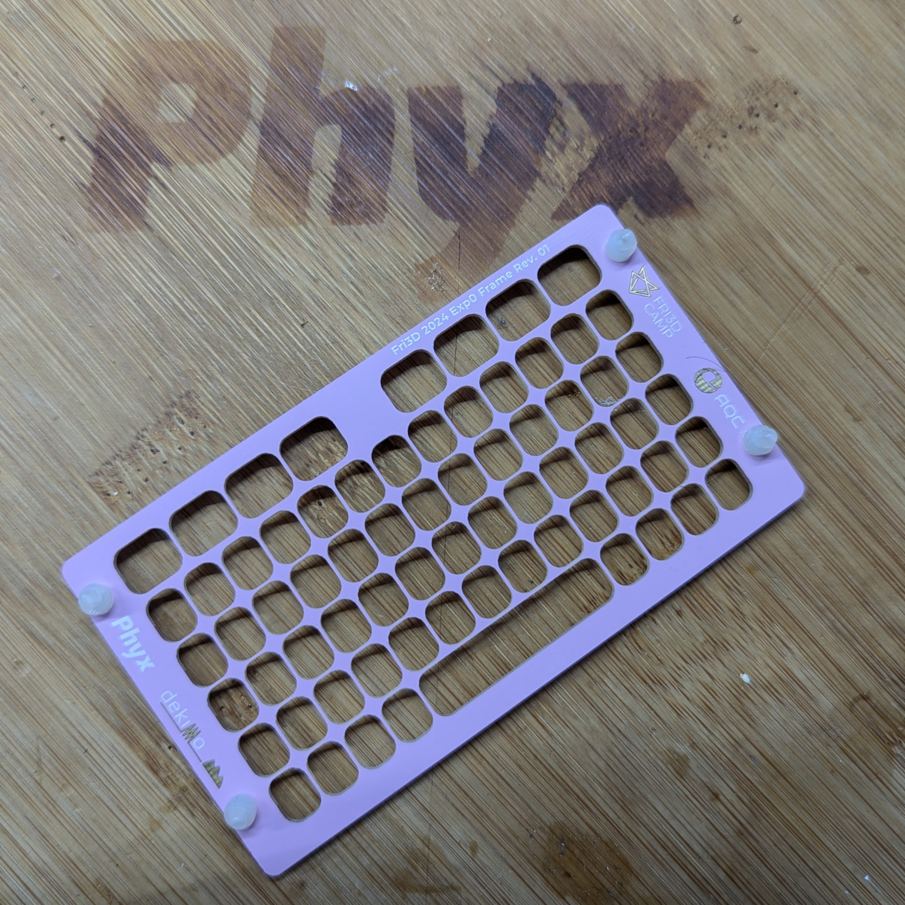
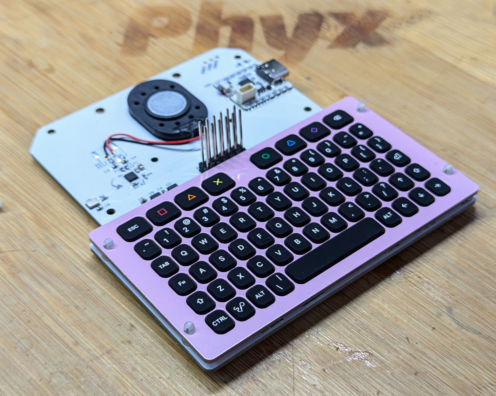

# Communicator add-on

## Communicator eigenschappen

The communicator bestaat uit:

- QWERTY toetsenbord met achtergrond verlichting ontworpen door [Solder Party](https://www.solder.party/)
- op RISC-V gebaseerd microcontroller module [LANA TNY](https://phyx.be/LANA_TNY/)
- [TDK ICS43434](https://invensense.tdk.com/products/ics-43434/) microfoon
- [Analog Devices MAX98357A](https://www.analog.com/en/products/max98357a.html) DAC met versterker
- kleine luidspreker

Je kan het toetsenbord ook als USB toetsenbord gebruiken, echter **sluit de USB kabel niet aan wanneer het bord aan de badge hangt!**

De ontwerp- en bronbestanden kan je terugvinden in de [GitHub repository](https://github.com/Fri3dCamp/communicator_2024)

## Stap voor stap assemblage handleiding

### Alle componenten netjes verpakt

Het pakje dat je ontvangen hebt bevat alles wat je nodig hebt om de communicator add-on te bouwen

- Communicator printplaat
- Roze afdekplaat
- 4 x 16mm lange plastieken pin
- 4 x 2mm lange plastieken pin
- luidspreker
- siliconen toetsenbord
- 2 x 6 pin extra lange pinnen

### Monteer de luidspreker

Verwijder de plastieken laag om de luidspreker op de printplaat te kleven. Soldeer de 2 draden op de printplaat. De rode draad moet naar het soldeervlak gaan dat gemarkeerd is met een `+`

### Soldeer de lange pinnen

Plaatse de langen pinnen aan de zijde met alle componenten. Je kan een andere vrouwelijke connector (of zelfs de badge) gebruiken om de 2 losse pinnen stroken netje gealigneerd te houden tijdens het solderen.

### Monteer het toetsenbord

Duw de 2mm lange plastieken pinnetjes in de roze cover. Let het siliconen toetsenbord er in en klik het geheel op de communicator printplaat.

### Connecteer de communicator met de badge

Duw de 16mm lange plastieken pinnetjes in de 4 gaten die overeenkomen met de badge. Verwijder de beschermende achterplaat en duw de communicator op zijn plaats.

## Gebruik

Het toetsenbord doet zich voor als een HID input toestel.
met de `Fn` toets kan je speciale functies activeren:

- `Fn+Rood`: Maak de LED op LANA rood
- `Fn+Oranje`: Maak de LED op LANA oranje
- `Fn+Geel Fri3d logo`: Maak de LED op LANA geel
- `Fn+Groen`: Maak de LED op LANA groen
- `Fn+Blauw`: Maak de LED op LANA blauw
- `Fn+Paars`: Maak de LED op LANA paars
- `Fn+Solder Party`: Zet de LED op LANA uit
- `Fn+Backspace`: Delete
- `Fn+Omhoog`: Page Up
- `Fn+Omlaag`: Page Down
- `Fn+Links`: Home
- `Fn+Rechts`: End
- `Fn+Spatiebalk`: schakel de achtergrond verlichting aan/uit
- `Fn+Rechtse Shift`: Schakel Caps Lock

## Firmware functies

De firmware stuurt [HID pakketten](https://files.microscan.com/helpfiles/ms4_help_file/ms-4_help-02-46.html) (8 bytes) uit op USB, I2C (adres `0x38`) en UART.

De eerste byte geeft aan welke modificatietoetsen zijn ingedrukt:

| Bit | Modifier Key |
| --- | ------------ |
| 0   | LINKSE CTRL    |
| 1   | LINKSE SHIFT   |
| 2   | LINKSE ALT     |
| 3   | LINKSE GUI     |
| 4   | RECHTSE CTRL   |
| 5   | RECHTSE SHIFT  |
| 6   | RECHTSE ALT    |
| 7   | RECHTSE GUI    |

De tweede byte is gereserveerd, de overige 6 bytes kunnen een [HID-sleutelcode](https://gist.github.com/MightyPork/6da26e382a7ad91b5496ee55fdc73db2) bevatten.
